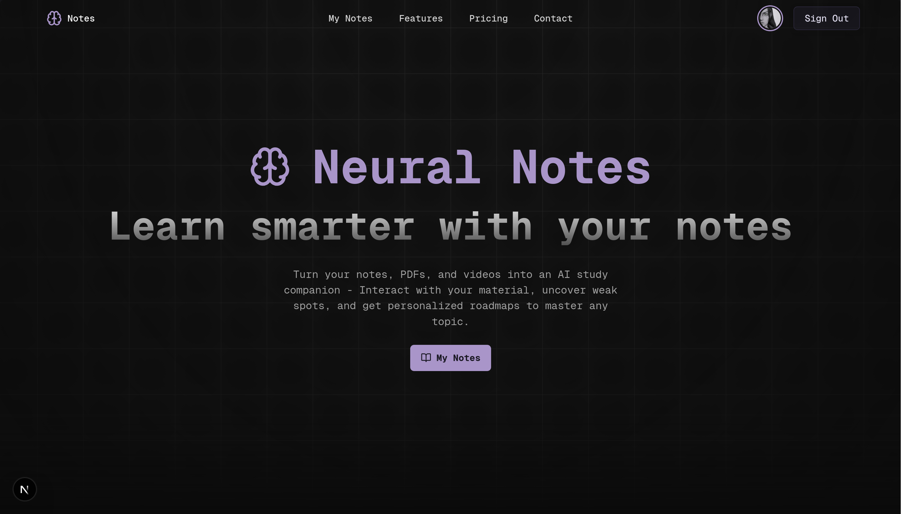
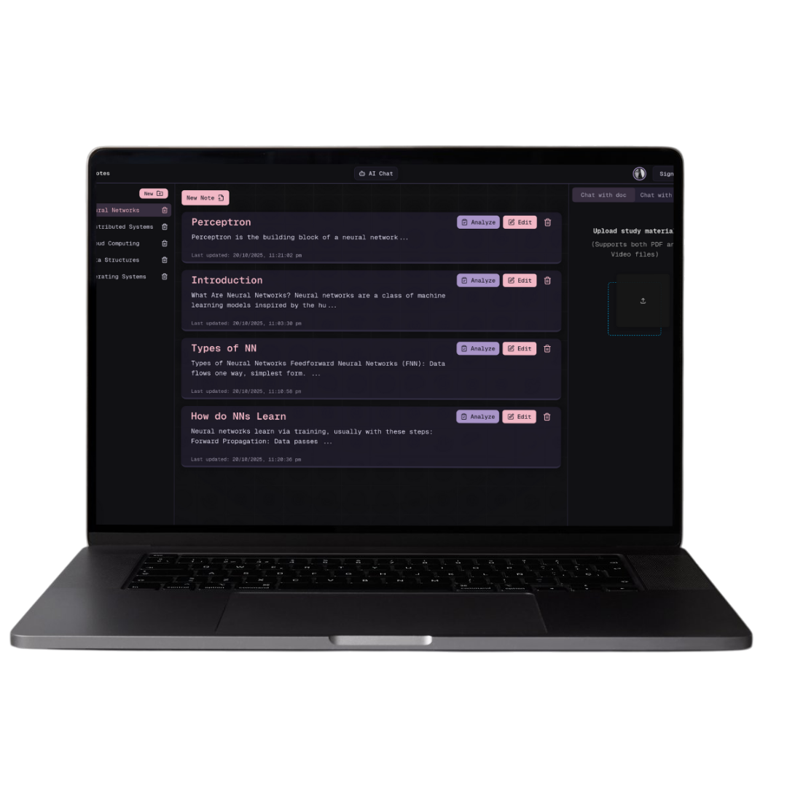
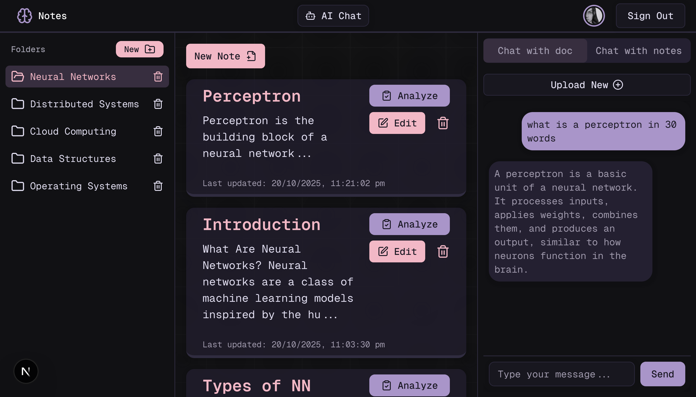
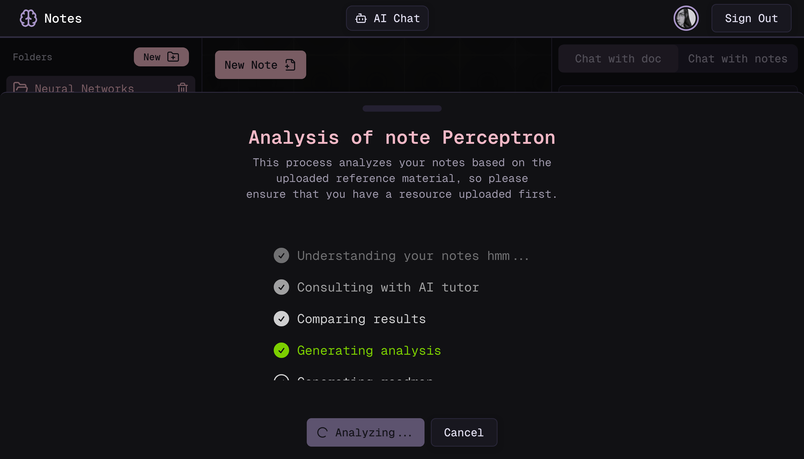

# Neural Notes 

An intelligent notes app that combines powerful notes capabilities with AI-powered analysis and tutoring capabilities. Transform your study materials into interactive learning experiences with personalized AI tutors and comprehensive content analysis.



## ✨ Features

### 📝 Smart Note Management
- **Rich Markdown Editor**: Seamless writing experience with real-time preview
- **Folder Organization**: All your notes organized into folders
- **Auto-sync**: Real-time saving and synchronization across sessions



### 🤖 AI-Powered Learning
- **AI Tutor Chat**: Interactive conversations with AI tutors trained on your materials
- **Multi-format Upload**: Support for PDFs, videos, and other reference materials
- **Note-based Tutoring**: Generate personalized tutors from your existing notes
- **Contextual Learning**: Get explanations and help tailored to your specific content



### 📊 Intelligent Analysis
- **Content Gap Analysis**: Identify missing points and knowledge gaps
- **Keyword Extraction**: Discover important terms and concepts you might have missed
- **Study Roadmaps**: Get in depth roadmaps for improvement and next steps




## 🚀 Getting Started

### Quick Overview

Neural Notes consists of two services that work together:

1. **AI Service** (`/ai-service`) - FastAPI backend for document processing and AI features
2. **Frontend App** (`/app`) - Next.js web application for user interaction

### Prerequisites
- Node.js (v18+) and Python (3.8+)
- FFmpeg (for video processing)
- OpenRouter API key (for AI features)

### Setup
```bash
git clone https://github.com/ReetamBG/Neural-Notes.git
cd Neural-Notes
```

Then follow the detailed setup instructions in each service's README:
- **AI Service Setup**: See [`/ai-service/README.md`](./ai-service/README.md)
- **Frontend Setup**: See [`/app/README.md`](./app/README.md)


## 🎯 Use Cases

### Students
- Upload lecture videos and PDFs to create personalized study tutors
- Analyze your notes to get instant feedback
- Get study recommendations based on knowledge gapsn

### Researchers  
- Process research papers and create searchable knowledge bases
- Analyze literature reviews for completeness and accuracy
- Organize and cross-reference multiple sources


## 🛠️ Technology Stack

**Frontend**
- Next.js 15, TypeScript, Tailwind CSS
- Radix UI, TipTap Editor, Clerk Auth
- Prisma ORM, Zustand State Management

**Backend**  
- FastAPI, LangChain, OpenAI/OpenRouter
- ChromaDB, Vosk, NLTK, scikit-learn
- PyPDF, FFmpeg, HuggingFace Transformers

## 📁 Project Structure

```
Neural-Notes/
├── app/                    # Next.js frontend application
│   ├── src/
│   │   ├── components/     # React components
│   │   ├── app/           # App router pages
│   │   └── lib/           # Utilities and configurations
│   ├── prisma/            # Database schema and migrations
│   └── package.json
├── ai-service/            # FastAPI backend service  
│   ├── app/
│   │   ├── api/           # API endpoints
│   │   ├── services/      # Business logic
│   │   └── models/        # Data models
│   ├── data/              # File storage and vector DBs (auto generated)
│   └── requirements.txt
└── README.md
```

## 🤝 Contributing

We welcome contributions! Please:

1. Fork the repository
2. Create a feature branch (`git checkout -b feature/amazing-feature`)
3. Follow the setup instructions in individual service READMEs
4. Make your changes with proper testing
5. Submit a Pull Request with clear description

See individual service READMEs for detailed development workflows and technical guidelines.

## 📄 License

This project is licensed under the MIT License - see the [LICENSE](LICENSE) file for details.

---

**Made with ❤️ for learners and educators everywhere**